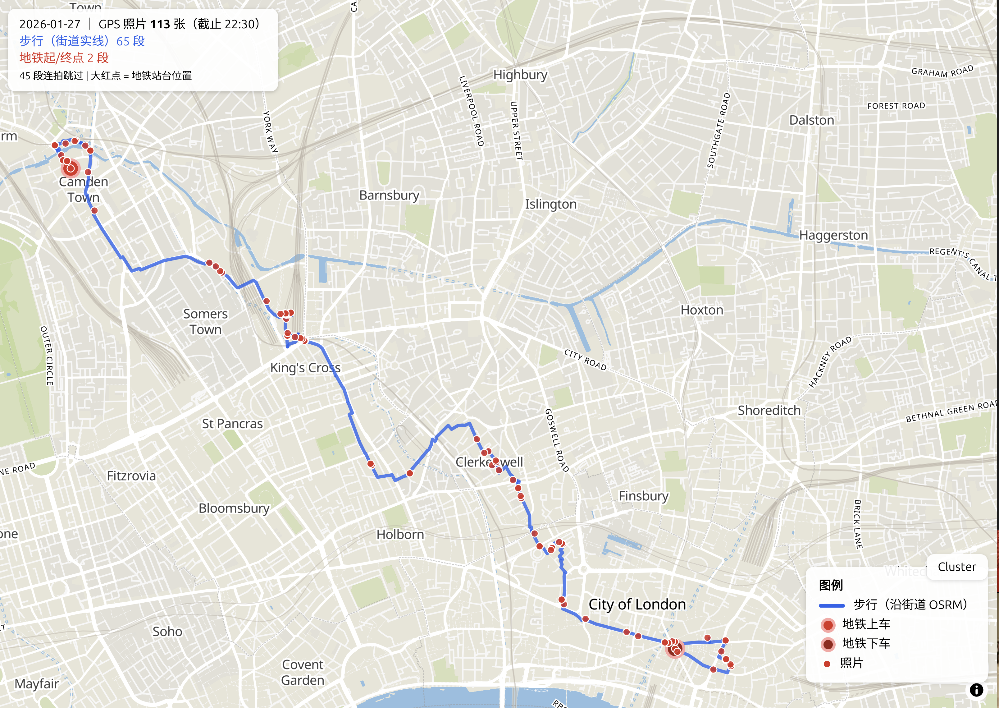

# MapTrace

> Extract GPS metadata from photo libraries, classify trips into walking / transit segments, and render real walking routes on an interactive OSM map — all from local data, no cloud services.



## What It Does

1. **Extract** — pulls `filename / timestamp / GPS` from date-named album folders into tab-separated text files (one per day)
2. **Classify** — identifies walking vs subway segments by time interval + distance between consecutive GPS photos
3. **Route** — queries OSRM for street-level walking paths along actual roads (not straight lines)
4. **Visualize** — generates self-contained MapLibre HTML pages over a local vector-tile server, with clustered photo markers, walking lines, and transit entry/exit dots

Everything runs offline — map tiles, fonts, routing engine, and vector basemap are all served from `localhost`.

## Architecture

```
Album library (read-only)
       │
       ▼
  extract_gps.py ──► gps_data/<date>.txt
       │
       ▼
  Transport classifier (speed + distance rules)
       │
       ├── walking segments ──► OSRM :5000 ──► street-level route
       │
       └── tube segments   ──► red markers only (start/end GPS points)
       │
       ▼
  gen_routed_page.py ──► web/<date>-routed.html
       │
       ├── basemap   ── tileserver-gl :8088
       ├── markers   ── photo dots + transit entry/exit
       └── lines     ── OSRM walking paths
```

## Dependencies

### System
| Package | Version | Install |
|---|---|---|
| `osmium` | 1.16+ | `apt install osmium-tool` |
| `docker` | 26+ | [docker.com](https://docs.docker.com/engine/install/) |
| `python3` | 3.10+ | already present on most distros |
| `java` | 21+ | `apt install openjdk-21-jre` |
| `wget` / `curl` | — | `apt install wget curl` |

### Python
```bash
pip3 install Pillow networkx shapely --break-system-packages
```

> Use `--break-system-packages` or a venv — depends on your Python packaging policy.

### Docker images
```bash
docker pull maptiler/tileserver-gl            # vector tile server
docker pull ghcr.io/project-osrm/osrm-backend # walking router
```

> If Docker Hub is blocked by a mirror (403), use `ghcr.io/project-osrm/osrm-backend` directly.

### Java tools
```bash
# planetiler jar (place in ~/Downloads or anywhere)
wget https://github.com/onthegomap/planetiler/releases/latest/download/planetiler.jar
```

### Data sources (for London)

| File | Size | Source |
|---|---|---|
| `planet-260720.osm.pbf` | 88 GB | [planet.openstreetmap.org](https://planet.openstreetmap.org/) (or any regional extract) |
| `natural_earth_vector.sqlite.zip` | 415 MB | [naciscdn.org](https://naciscdn.org/naturalearth/packages/natural_earth_vector.sqlite.zip) |
| `water-polygons-split-3857.zip` | 886 MB | [osmdata.openstreetmap.de](https://osmdata.openstreetmap.de/download/water-polygons-split-3857.zip) |
| `lake_centerline.shp.zip` | 78 MB | [github.com/acalcutt/osm-lakelines](https://github.com/acalcutt/osm-lakelines/releases/download/v12/lake_centerline.shp.zip) |

All data files go into `data/sources/` (or adjust paths in the scripts).

## Quick Start

```bash
# 1. Extract London bbox from the planet file
osmium extract --overwrite -b -0.51,51.28,0.33,51.69 \
  planet-260720.osm.pbf -o london.osm.pbf

# 2. Build vector tiles (planetiler)
java -Xmx16g -jar ~/Downloads/planetiler.jar \
  --osm-path=london.osm.pbf --output=london.mbtiles --force

# 3. Start tile server
docker run -d --name tileserver-gl-london \
  -p 8088:8080 -v $(pwd):/data maptiler/tileserver-gl

# 4. Build OSRM walking graph
docker run --rm -v $(pwd):/data ghcr.io/project-osrm/osrm-backend \
  osrm-extract -p /opt/foot.lua /data/london.osm.pbf
docker run --rm -v $(pwd):/data ghcr.io/project-osrm/osrm-backend \
  osrm-partition /data/london.osrm
docker run --rm -v $(pwd):/data ghcr.io/project-osrm/osrm-backend \
  osrm-customize /data/london.osrm

# 5. Start routing engine
docker run -d --name osrm-london -p 5000:5000 \
  -v $(pwd):/data ghcr.io/project-osrm/osrm-backend \
  osrm-routed --algorithm mld /data/london.osrm

# 6. Start static file server for web pages
cd web && python3 -m http.server 8089 --bind 127.0.0.1 &

# 7. Extract GPS metadata from album photos
#    (point to your date-named folder tree: YYYY/YYYY-MM-DD/*.jpg)
python3 tools/extract_gps.py ./photos/2026 gps_data 2026-01-12 2026-02-06

# 8. Generate a day's transport-annotated map
python3 tools/gen_routed_page.py gps_data/2026-01-27.txt \
  web/2026-01-27-routed.html 22:30

# 9. Open in browser
xdg-open http://127.0.0.1:8089/2026-01-27-routed.html
```

## Services (running ports)

| Port | Service | Container |
|---|---|---|
| 8088 | Vector tile server | `tileserver-gl-london` |
| 5000 | OSRM walking router | `osrm-london` |
| 8089 | Static files (web pages) | `python3 http.server` |

## Tool Scripts

| Script | Purpose |
|---|---|
| `tools/extract_gps.py` | Pull photo metadata from album folders (`extract_gps.py <src> [out] [start] [end]`) |
| `tools/gen_map_page.py` | Simple marker-only map page |
| `tools/gen_transport_page.py` | Transport-classified map (straight lines) |
| `tools/gen_routed_page.py` | **Full version** — OSRM walking routes + tube markers + cluster toggle |
| `tools/classify_transport.py` | Terminal-only classification report |
| `tools/build_tube_graph.py` | Build tube station graph from OSM (optional) |

## File Layout

```
MapTrace/
├── tools/                     # Python scripts (IN git)
├── gps_data/                  # per-day GPS metadata (generated)
├── web/                       # generated HTML pages
├── data/sources/              # planetiler input data (to download)
├── london.osm.pbf             # your bbox extract (not in git)
├── london.mbtiles             # vector tiles (not in git)
├── london.osrm*               # OSRM routing graph (not in git)
├── README.md                  # this file (IN git)
└── .gitignore                 # only tracks *.py and *.md
```

## Notes

- **Album library is read-only** — the extraction script never writes or deletes files in the photo source directory; pass the folder path as a CLI argument to `extract_gps.py`
- **Network issues** — GitHub downloads may fail intermittently; the three Natural Earth data sources are cached in `data/sources/`
- **Ports 8080-8082 may be occupied** by other services on the machine — tileserver uses 8088
- **Tube routing** — the subway track graph exists but is currently not used; transit segments only show start/end markers (red dots) due to accuracy issues with track-level routing
